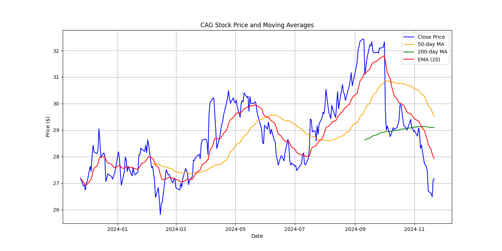
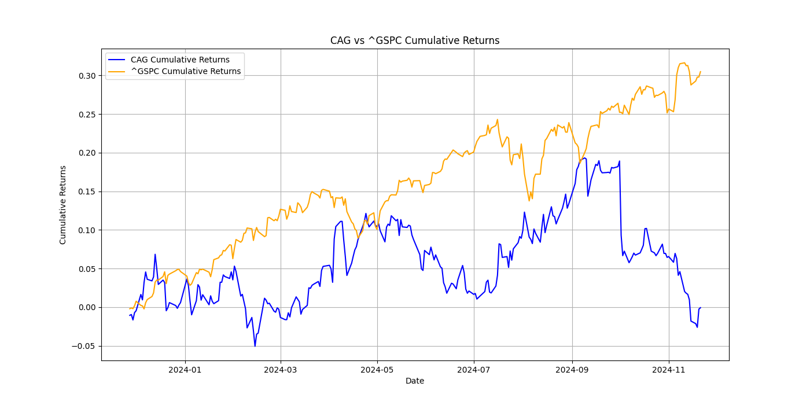

# Financial Report for Conagra Brands, Inc. (Ticker: CAG)

## Company Overview
Conagra Brands, Inc. is a major player in the food industry, recognized for its extensive portfolio of packaged and frozen food products. The company markets various well-known brands, including Healthy Choice, Banquet, Marie Callender's, and Orville Redenbacher's, catering to diverse consumer preferences.

## Recent Financial Performance
The fiscal year ending 2023 highlights Conagra Brands' strong performance:
- **Total Revenue:** Approximately $11.61 billion, indicating resilience amidst changing consumer demands.
- **Net Income:** About $841 million, reflecting strong profitability.
- **Earnings Per Share (EPS):** Around $2.09, showcasing solid earnings performance.

### Key Financial Ratios
| Financial Ratio              | Value       |
|------------------------------|-------------|
| **Return on Equity (ROE)**   | 7.82%       |
| **Net Profit Margin**         | 7.24%       |
| **Current Ratio**             | 0.93        |
| **Debt to Equity Ratio**      | 1.45        |
| **P/E Ratio**                 | 38.36       |

- **Return on Equity (ROE):** 7.82%, indicating effective utilization of shareholder investments.
- **Net Profit Margin:** 7.24%, highlighting efficiency in converting revenue into profit.
- **Current Ratio:** 0.93, suggesting sufficient liquidity but slightly below the ideal benchmark.
- **Debt to Equity Ratio:** 1.45, indicating a moderate leverage position.

## Strategic Initiatives
Conagra Brands is actively pursuing several strategic initiatives:
- **Portfolio Diversification:** The company focuses on innovating and expanding its offerings to cater to evolving consumer preferences, including healthier and plant-based options.
- **Growth Strategies:** Conagra aims to capture growth through effective marketing, strategic acquisitions, and enhancing operational efficiency.

## SWOT Analysis
- **Strengths:** 
  - Strong brand portfolio with significant market recognition.
  - Established distribution networks for broad market access.

- **Weaknesses:** 
  - Vulnerability to fluctuations in commodity prices, potentially impacting production costs.

- **Opportunities:** 
  - Potential for expansion in international markets.
  - Increasing consumer demand for health-conscious and convenient food options.

- **Threats:** 
  - Competitive pressures from established food conglomerates and niche players.
  - Regulatory challenges regarding food safety and labeling.

## Technical Analysis
- **Current Price:** $27.17
- **52-Week Range:** $26.21 - $33.24
- **YTD Price Change:** -3.58%
- **Trend:** Upward
- **Volatility:** 22.29%
- **Beta:** 0.05, indicating very low volatility compared to the overall market.

### Key Technical Indicators
- **50-Day Moving Average:** $29.52  
- **200-Day Moving Average:** $29.09  
- **Stochastic %K:** 29.54, suggesting potential upward momentum.  
- **MACD:** -0.74, indicating bearish momentum.

### Visual Representations
-   
  *Trend in Conagra Brands' stock price*

-   
  *Returns comparison between Conagra Brands and S&P 500*

-   
  *Bollinger Bands analysis of Conagra Brands' stock*

## Conclusion
Conagra Brands, Inc. has demonstrated robust financial performance and continues to position itself strongly within the food industry. With a clear focus on product diversification and operational efficiencies, Conagra is poised for ongoing growth in a competitive landscape. Stakeholders should closely monitor the company’s developments and market positioning.

For more detailed financial information, stakeholders can refer to Conagra's [Annual Report for 2023](https://www.conagrabrands.com/investors/financial-information).

---

This report summarizes available financial insights and recent performance metrics for Conagra Brands, Inc. For further information, please consult official documents and press releases from the company.