```markdown
# Financial Report on Nvidia Corporation (Ticker: NVDA)

## Company Overview
Nvidia Corporation (NVDA) is a leading American technology company specializing in GPUs and AI computing. The company's robust portfolio serves various sectors, including gaming, data centers, and automotive, enabling significant growth in the technology landscape.

---

## Recent Financial Performance

### Key Financial Ratios (2024)
- **Return on Equity (ROE):** 69.24%
- **Net Profit Margin:** 48.85%
- **Current Ratio:** 4.17
- **Debt to Equity Ratio:** 0.53
- **Price to Earnings Ratio (P/E):** 12.11

### Financial Data Trends
- **Revenue Growth:** 236.21% (2024)
- **Net Income:** Strong upward trajectory, reflecting efficient operations.

#### Graphical Data
- **Net Income Over Time:**
  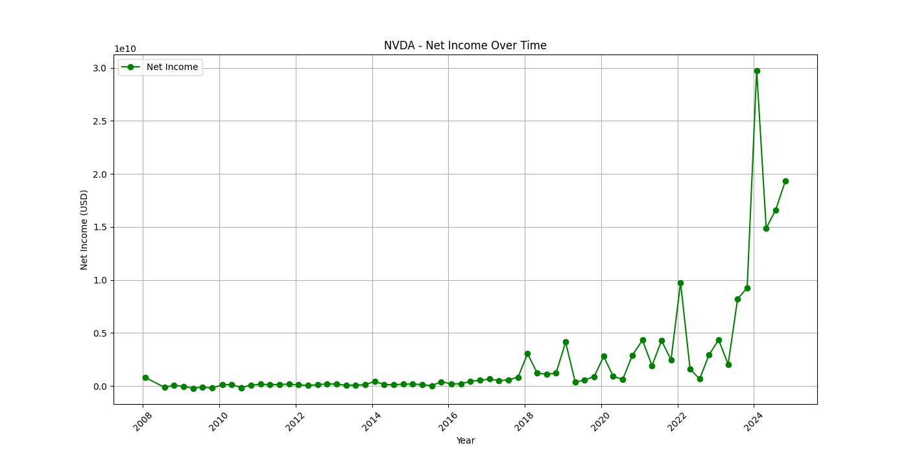
- **Total Assets:**
  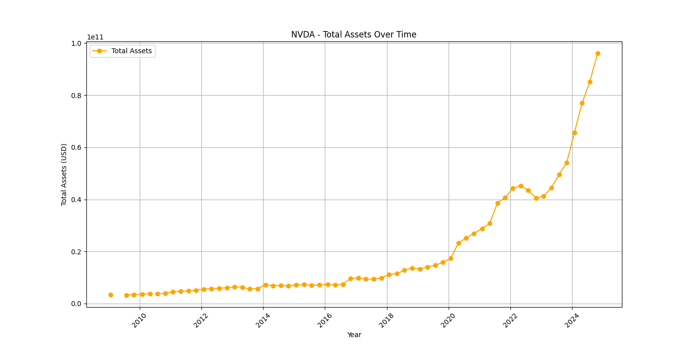
- **Revenue Growth Rate:**
  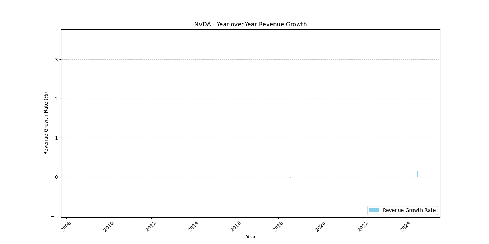
- **Return on Equity:**
  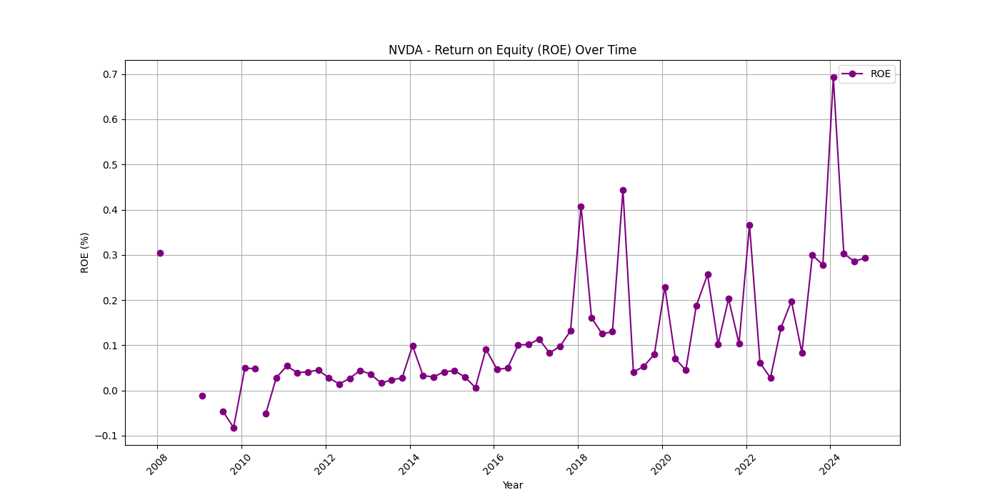
- **Current Ratio:**
  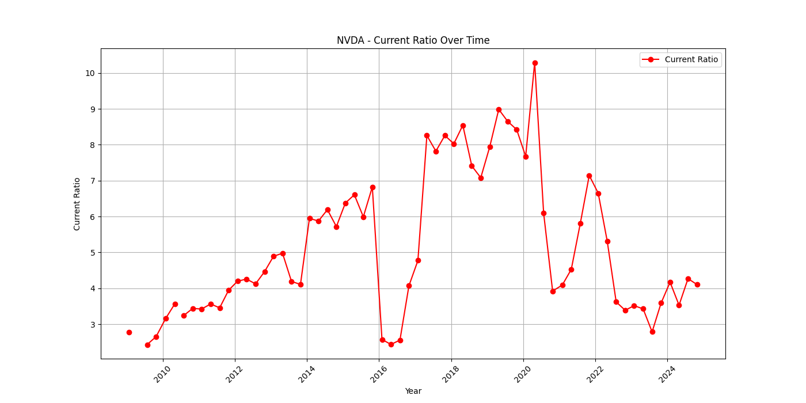
- **Debt to Equity Ratio:**
  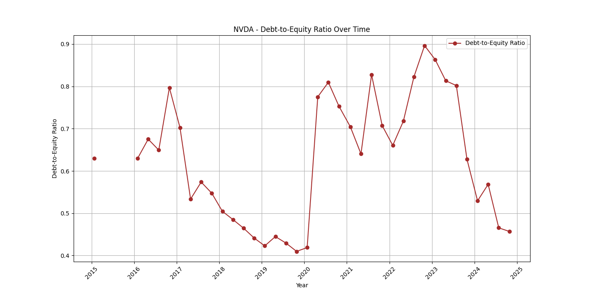

---

## Stock Analysis Summary

- **Current Price:** $145.89
- **52-Week High:** $149.77
- **52-Week Low:** $45.01
- **Year-to-Date Price Change:** 97.73% (YTD Percent Change: 202.94%)
- **Trend:** Upward
- **Volatility:** Moderate (0.52)
- **Beta:** 2.78 (indicates higher volatility compared to the market)

### Technical Indicators
- **50-Day Moving Average:** 132.99
- **200-Day Moving Average:** 110.03
- **EMA (20):** 142.29
- **MACD:** 3.34
- **Stochastic %K:** 74.47
- **Bollinger Bands (%B):** 0.68

#### Graphical Data
- **Historical Price Performance:**
  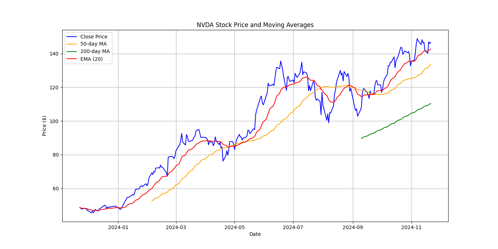
- **Comparison with Benchmark (S&P 500):**
  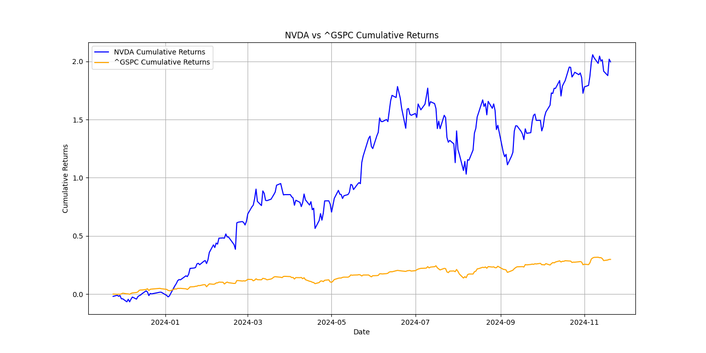
- **MACD Chart:**
  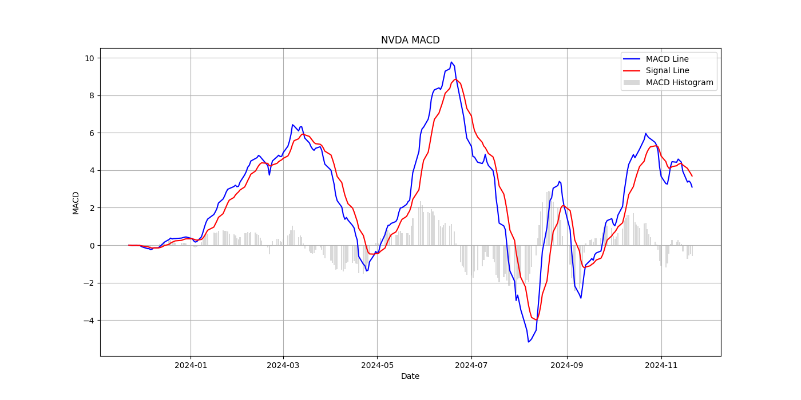
- **Bollinger Bands:**
  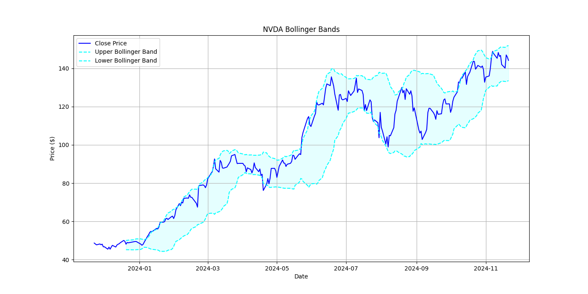
- **Stochastic Oscillator:**
  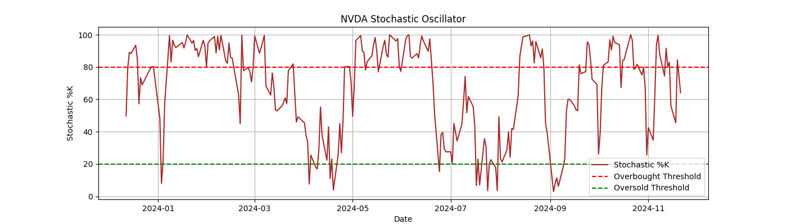
- **Momentum Indicator:**
  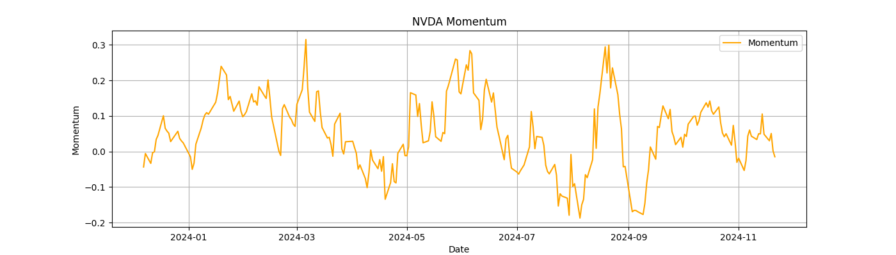

---

## SWOT Analysis of Nvidia

1. **Strengths:**
   - Market leadership in GPU technology.
   - Strong brand recognition and reputation for innovation.

2. **Weaknesses:**
   - High dependency on the gaming sector.
   - Elevated operational costs.

3. **Opportunities:**
   - Expanding AI market adoption.
   - Growth in automotive and data center markets.

4. **Threats:**
   - Intense competition from companies like AMD and Intel.
   - Regulatory scrutiny as the company grows.

---

## Conclusion

Nvidia showcases impressive financial health with substantial growth in revenue and profitability. The company's strong position in AI and GPU markets prepares it to capitalize on emerging trends. However, competition and market volatility remain critical considerations for sustaining growth.

For detailed insights into Nvidia's financial performance and market position, refer to their [investor relations page](https://investor.nvidia.com/financial-info/financial-reports/default.aspx).
```
TERMINATE