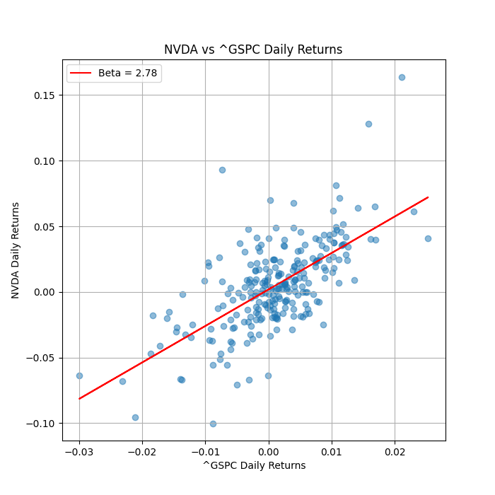

# Comprehensive Financial Report for Nvidia Corporation (As of Q3 2024)

## Table of Contents
1. [Overview](#overview)
2. [Key Financial Highlights](#key-financial-highlights)
3. [Financial Ratios](#financial-ratios)
4. [Technical Analysis](#technical-analysis)
5. [SWOT Analysis](#swot-analysis)
6. [Conclusion](#conclusion)
7. [Sources](#sources)

---

## Overview
Nvidia Corporation (NASDAQ: NVDA) has distinguished itself as a leader in technology, capitalizing on the burgeoning demand for graphics processing units (GPUs) largely driven by advancements in artificial intelligence (AI) and cloud computing technologies. This report will break down Nvidia's latest financial performance, technical indicators, and strategic positioning in the financial landscape.

## Key Financial Highlights
- **Revenue**: $18.12 billion for Q3 2024, a remarkable increase of 206% year-over-year and 34% quarter-over-quarter.
- **Net Profit Margin**: 51%, reflecting effective cost management.
- **Earnings Per Share (EPS)**: Showing substantial growth amid strong demand.

## Financial Ratios
| Ratio                     | Value      |
|---------------------------|------------|
| Return on Equity (ROE)    | 27.79%     |
| Net Profit Margin          | 51.01%     |
| Debt to Equity Ratio       | 0.6278     |
| Current Ratio              | 3.588      |

These ratios illustrate Nvidia's strong financial positioning and operational efficiency.

## Technical Analysis
### Current Stock Price
- **Price**: $144.17
- **52-Week High**: $152.89
- **52-Week Low**: $45.01

### Moving Averages
- **50-Day Moving Average**: $133.50
- **200-Day Moving Average**: $110.40

### Year-to-Date Performance
- **YTD Price Change**: $96.01
- **YTD Percent Change**: 199.37%

### Trend Analysis
- **Current Trend**: Upward, showing sustained investor confidence.
- **Volatility**: Moderate (0.52)
- **Beta**: 2.78 (indicating higher volatility compared to the market)

### Technical Indicators
- **Relative Performance**: 1.66 (strong performance relative to benchmark)
- **MACD**: 3.10 (indicative of bullish sentiment)
- **Stochastic %K**: 49.65 (neutral to potentially bullish)

### Visual Aids
  
  
  
  
  
  
  

## SWOT Analysis
### Strengths
- Leading player in AI and GPU technologies.
- Strong financial metrics demonstrating profitability and efficient operational management.

### Weaknesses
- High dependency on the gaming and AI sectors, which can be volatile.
- Relatively high stock price compared to historical averages creates potential entry barriers for new investors.

### Opportunities
- Expanding markets in AI, autonomous machines, and cloud computing.
- Potential for partnerships and innovations in new tech sectors.

### Threats
- Intense competition from other tech firms.
- Fluctuations in semiconductor demand and supply chains.

## Conclusion
Nvidia's financial performance for Q3 2024 reflects a company in growth mode, characterized by exceptional revenue increases and strong profitability metrics. Technical indicators corroborate this upward trajectory, suggesting favorable market conditions ahead.

The combination of robust fundamentals and favorable technical analysis makes Nvidia a compelling choice for investors looking to engage with a high-growth technology leader. 

## Sources
- [NVIDIA Financial Results for Q3 2024](https://nvidianews.nvidia.com/news/nvidia-announces-financial-results-for-third-quarter-fiscal-2024)
- [Nvidia Stock Performance](https://www.statmuse.com/money/ask/nvidia-stock-price-in-oct-2023)

**TERMINATE**