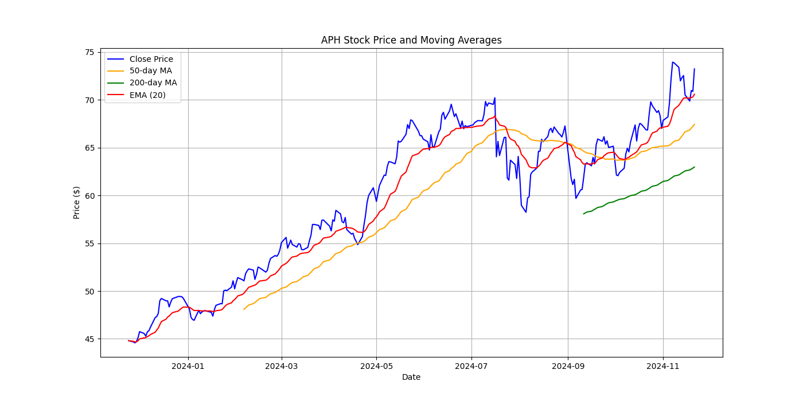
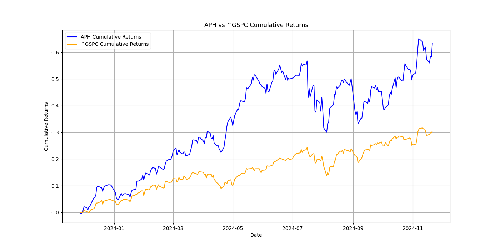
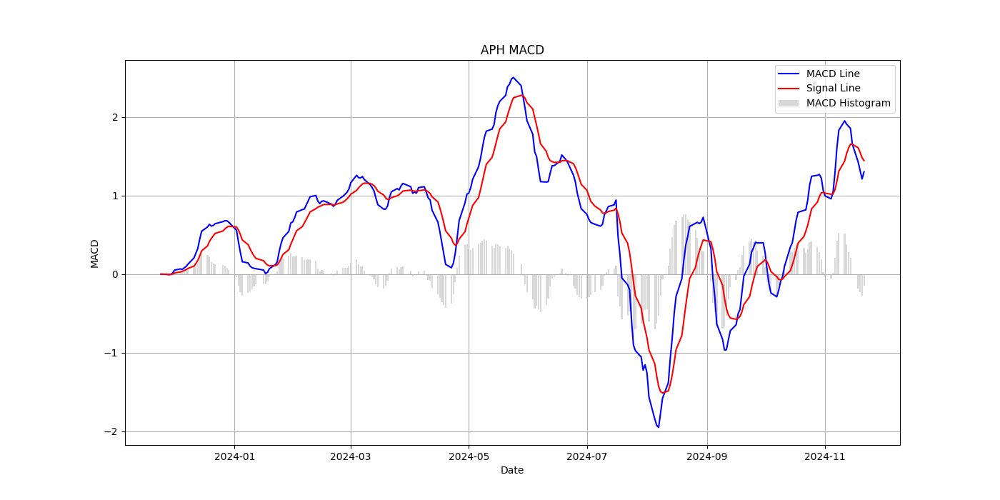

# Financial Report on Amphenol Corporation (2023)

## Overview
Amphenol Corporation is a leading multinational technology company specializing in the design and manufacturing of high-performance interconnect, sensor, and antenna solutions. In 2023, Amphenol has demonstrated resilience and notable performance, navigating various market conditions effectively.

---

## Recent Financial Performance
- **Sales**: In Q4 2023, Amphenol reported record sales of **$3.33 billion**, up **3%** in U.S. dollars compared to the previous year, though there was a **1%** decline in organic sales.

### Key Financial Ratios and Metrics

| Metric                         | Value                |
|--------------------------------|---------------------|
| **Return on Equity (ROE)**     | 23.10%              |
| **Net Profit Margin**           | Data Not Available   |
| **Gross Margin**                | Data Not Available   |
| **Current Ratio**               | 2.17                |
| **Quick Ratio**                 | 1.48                |
| **Debt to Equity Ratio**        | 0.97                |
| **Interest Coverage Ratio**     | 18.35               |
| **EPS Growth**                  | 6.51%               |
| **Revenue Growth**              | Data Not Available   |
| **Price-to-Earnings Ratio (PE)**| 22.67               |

---

## Qualitative Insights
- **Risk Management**: The company maintains a structured oversight on cybersecurity governance with involvement from the Board of Directors and Audit Committee, ensuring continuous assessment and improvement of cybersecurity programs.
  
- **Stock Buyback Program**: A new stock repurchase program was announced, allowing up to **$2 billion** for repurchases until April 28, 2027. This program aims to enhance shareholder value while ensuring the company retains flexibility for future investments.

---

## Technical Stock Analysis

- **Current Price**: $73.24
- **52-Week High**: $74.70
- **52-Week Low**: $44.82
- **YTD Price Change**: **25.13%**
- **YTD Percent Change**: **52.22%**
- **Trend**: Upward
- **Volatility**: **25.81%**
- **Beta**: **1.50** (indicating higher volatility compared to the market)
- **Relative Performance**: **0.33**

### Indicators

| Indicator                       | Value                |
|--------------------------------|---------------------|
| **50-Day Moving Average**      | $67.43              |
| **200-Day Moving Average**     | $62.97              |
| **Stochastic %K**              | 79.55 (overbought)  |
| **MACD**                       | 1.30 (upward momentum) |

---

## Visual Financial Analysis

---

## SWOT Analysis

### Strengths
- Strong return on equity (ROE) at 23.10%.
- Robust liquidity positions with current and quick ratios above 1.
- High interest coverage ratio indicating good capacity to meet interest obligations.

### Weaknesses
- Decline in organic sales, suggesting potential market challenges.
- Lack of comprehensive data on net profit and gross margins.

### Opportunities
- New stock repurchase program can positively affect stock value and shareholder sentiment.
- Continuous demand for innovative interconnect and sensor solutions in various industries.

### Threats
- Increased competition in the technology and connectivity sectors.
- Market volatility potentially affecting financial performance in the future.

---

## Conclusion
Amphenol Corporation shows a solid financial health with impressive metrics, including a robust ROE and strong liquidity. The stock repurchase initiative exemplifies the company’s commitment to returning value to shareholders. However, monitoring future performance is crucial, especially given the stock's current overbought position. Stakeholders are encouraged to follow market trends and the performance of Amphenol closely in the coming quarters.

For detailed financial documents and reports, please visit the [Amphenol Investor Relations page](https://investors.amphenol.com/financials/quarterly-and-annual-reports/default.aspx). 

--- 

****This comprehensive report aggregates the financial insights and is intended for stakeholders looking to evaluate Amphenol Corporation's financial performance in 2023.**